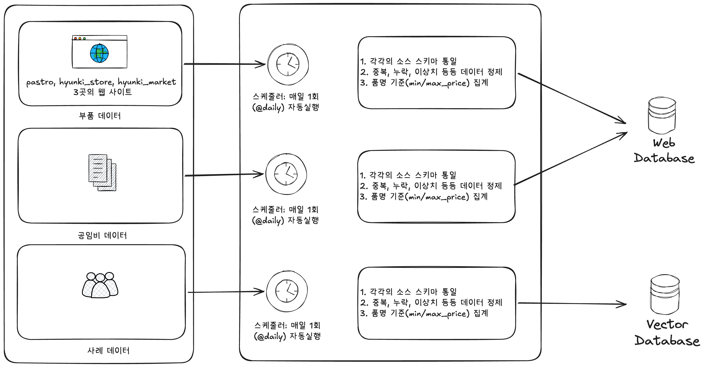
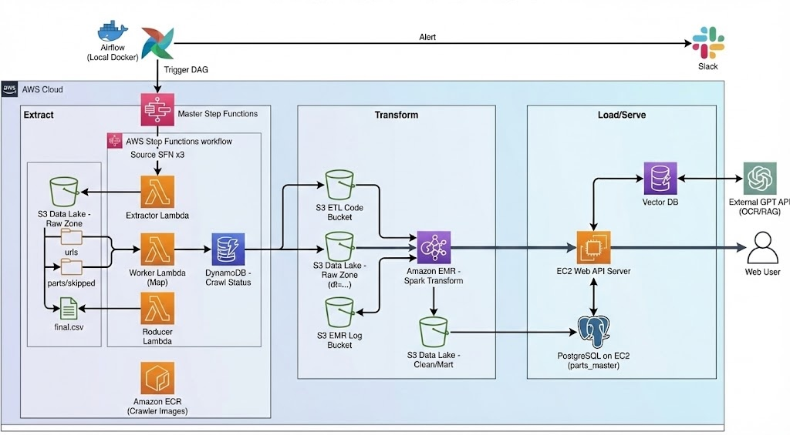

# Softeer Bootcamp 7th - DE Team1-DKids

## ❓ 견적서, 의심이 가시나요?

  
    차량 정비 견적서를 받고도 이 항목이 정말 필요한 건지, 
    과잉정비는 아닌지 판단하기 어렵지 않으신가요?
  

 

## 🧑🏻‍💻 팀원 소개

<table>
  <tbody>
    <tr>
      <td align="center" width="200">
        <a href="https://github.com/Sanghoon560">
          
           
          <b>이상훈 (Leader)</b>
        </a>
      </td>
      <td align="center" width="200">
        <a href="https://github.com/SJ-PARKs">
          
           
          <b>박성준</b>
        </a>
      </td>
      <td align="center" width="200">
        <a href="https://github.com/MS-JUNG">
          
           
          <b>정민수</b>
        </a>
      </td>
    </tr>
  </tbody>
</table>

---

## 문제정의

> "견적서 150만 원, 정말 이게 최선이었을까요?"  
> 실제 사례: 누유 진단을 받고 70만 원을 예상했으나, 청구 시점에 150만 원으로 증액.  
> 이후 타 전문가 확인 결과 '불필요한 크리닝'과 '내역에 없는 수리'가 포함된 것을 확인.

### 1️⃣ 상황 (Context)
전문 지식이 부족한 고객은 수리 항목의 필요성과 가격 적정성을 판단할 기준이 없습니다.  
특히 보증 종료 후 **유상 수리** 시,정보 비대칭으로 인한 **과잉 정비**에 대한 불신이 반복되고 있습니다.

### 2️⃣ 타겟 (Who)
* **유상 수리 대상 차량**을 보유한 일반 고객
* 정비 지식이 부족하여 수리 결정과 비용 부담 사이에서 판단 기준이 필요한 사용자

### 3️⃣ 어떤 문제 (Pain Points)
우리는 '과잉 정비'라는 막연한 불안감을 세 가지 구체적인 문제로 나누었습니다.

| 구분 | 상세 내용 |
| :--- | :--- |
| **항목의 적정성** | • 멀쩡한 부품의 불필요한 교환 • 부분 수리 대신 고가의 통교체 유도 • 교환 주기가 남은 소모품 교체 권유 |
| **부품가 투명성** | 일반적인 부품몰의 기준가보다 과도하게 높은 부품가 청구 |
| **공임비 합리성** | • 실제 소요 시간보다 긴 작업 시간 산정  • 기준을 벗어난 높은 시간당 공임 설정 • 종속적 작업에 대한 공임 중복 청구 |

## 해결 방법

## 데이터 소스

본 서비스는 다음 3가지 유형의 데이터를 기반으로 구성됩니다.

- **부품 데이터**: 제조사 및 온라인 마켓 기준 부품 가격 수집
- **공임비 데이터**: 작업 항목별 평균 공임 정보
- **사례 데이터**: 실제 정비 사례 및 사용자 경험 데이터

## 데이터 파이프라인 아키텍처

부품 데이터의 주기적 수집을 위해 Airflow 기반 AWS ETL 파이프라인을 구성했습니다.

## 기술적 고려사항
- [Airflow 구성 시 고려한 점](./airflow/README.md)
-  [Crawler 구성 시 고려한 점](./crawler/README.md)
- [전처리(Transformation) 시 고려한 점](./transformation/README.md)
- [RAG 구성 시 고려한 점](./web/rag/README.md)
- [Web 서비스 구성 시 고려한 점](./web/README.md)
