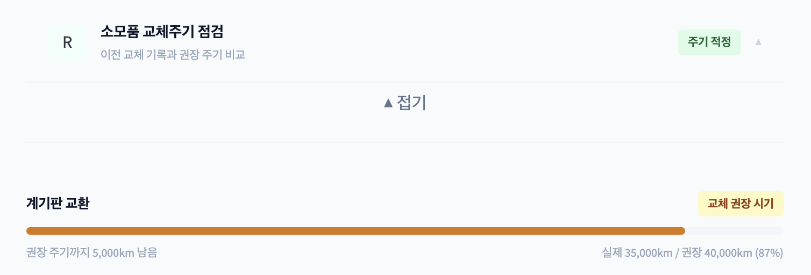
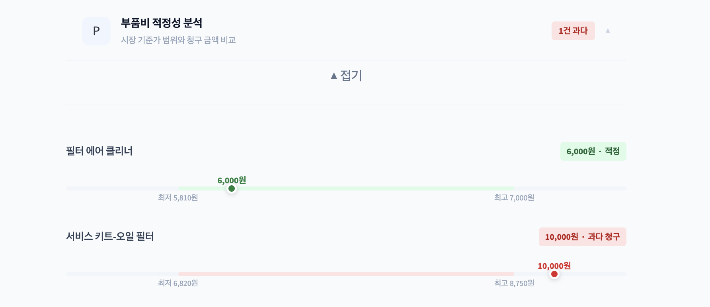
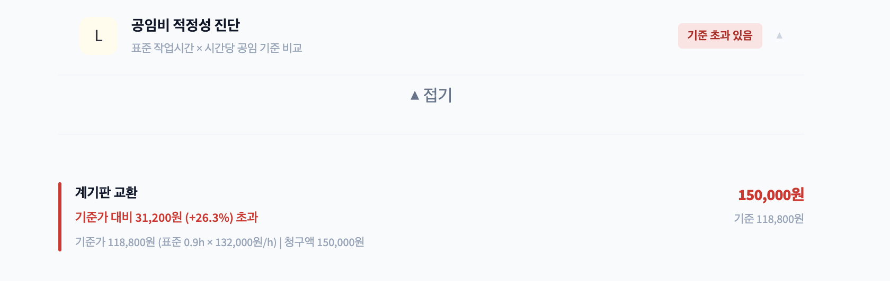
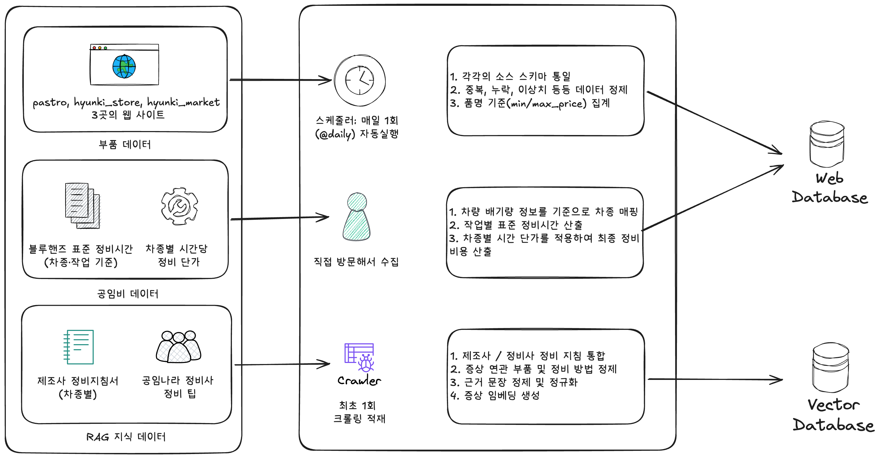
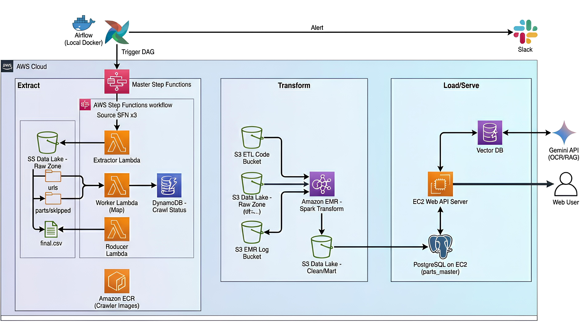

# Softeer Bootcamp 7th - DE Team1-DKids

## ❓ 견적서, 의심이 가시나요?

  
    차량 정비 견적서를 받고도 이 항목이 정말 필요한 건지, 
    과잉정비는 아닌지 판단하기 어렵지 않으신가요?
  

 

## 🧑🏻‍💻 팀원 소개

<table>
  <tbody>
    <tr>
      <td align="center" width="200">
        <a href="https://github.com/Sanghoon560">
          
           
          <b>👑이상훈</b>
        </a>
      </td>
      <td align="center" width="200">
        <a href="https://github.com/SJ-PARKs">
          
           
          <b>박성준</b>
        </a>
      </td>
      <td align="center" width="200">
        <a href="https://github.com/MS-JUNG">
          
           
          <b>정민수</b>
        </a>
      </td>
    </tr>
  </tbody>
</table>

---

## 문제정의

> “185만 원 정비, 정말 필요했을까요?”  
> LF 소나타 차주가 사이드미러 고장과 엔진오일 교체를 위해 블루핸즈를 방문함.   
> 브레이크 패드·오일, 점화코일 등 그 외 항목이 추가 정비되면서 총 185만 원이 청구됨.  
> 정비를 마친 뒤 차주는 모든 항목이 꼭 필요한 수리였는지, 공임비가 적절하게 책정된 것인지에 의문을 갖게 됨.  

### 1️⃣ 상황 (Context)
전문 지식이 부족한 고객은 수리 항목의 필요성과 가격 적정성을 판단할 기준이 없습니다.  
특히 보증 종료 후 **유상 수리** 시,정보 비대칭으로 인한 **과잉 정비**에 대한 불신이 반복되고 있습니다.

### 2️⃣ 타겟 (Who)
* 유상 수리를 진행해 사비로 많은 비용을 부담해야 하는 고객
* 정비 지식이 부족해 견적서 내 정비 항목 및 비용 적정성을 판단할 수 없는 차량 정비 의뢰인

### 3️⃣ 어떤 문제 (Pain Points)
우리는 '과잉 정비'라는 막연한 불안감을 세 가지 구체적인 문제로 나누었습니다.

| 구분 | 상세 내용 |
| :--- | :--- |
| **항목의 적정성** | • 입고 사유와 무관한 정비 항목  • 교환 주기가 남은 소모품 교체 |
| **부품가 투명성** | • 일반적인 부품몰의 기준가보다 과도하게 높은 부품가 청구 |
| **공임비 합리성** | • 실제 소요 시간보다 긴 작업 시간 산정  • 기준을 벗어난 높은 시간당 공임비 설정 |

## 해결 방법

### 1️⃣ 입고 사유와 무관한 정비 항목 진단

사용자가 입력한 입고 당시 증상과 견적서의 정비 항목을 비교합니다.  
이를 현대 정비 지침서 및 공임나라 정비 기준 데이터와 대조하여  
입고 사유와 직접적인 관련성이 낮은 항목을 식별합니다.

→ **증상 대비 과도하게 추가된 정비 항목 탐지**

### 2️⃣ 교환 주기가 남은 소모품 교체 분석

최근 교체 주행거리와 현재 주행거리의 차이를 계산한 뒤 제조사 권장 교환 주기와 비교합니다.     
견적서에 포함된 소모품이 실제로 교체 시점에 도달했는지 분석합니다. 

→ **조기 교체 여부 객관적 판단**

### 3️⃣ 부품비 적정성 분석

여러 온라인 부품몰의 가격 데이터를 수집하여 시장 가격 범위를 산출합니다.    
이를 견적서 상 부품 가격과 비교해 과도하게 높은 부품비 청구 여부를 분석합니다.  

→ **시장가 기반 부품비 검증**

### 4️⃣ 공임비 합리성 분석

정비 항목별 표준 정비 시간과 평균 시간당 공임비 데이터를 기반으로 적정 공임비를 계산합니다.  
이를 실제 청구된 공임비와 비교해 과다 산정 여부를 확인합니다.   

→ **작업 시간 및 공임 단가 검증**

## 데이터 소스

본 서비스는 다음 3가지 유형의 데이터를 기반으로 구성됩니다.

- **부품 데이터**: 제조사 및 온라인 마켓 기준 부품 가격 수집
- **공임비 데이터**: 작업 항목별 평균 공임 정보
- **RAG 지식 데이터**: 공임나라 정비사 정비 팁 및 제조사 정비지침서

## 데이터 파이프라인 아키텍처

부품 데이터의 주기적 수집을 위해 Airflow 기반 AWS ETL 파이프라인을 구성했습니다.

## 기술적 고려사항
- [Airflow 구성 시 고려한 점](./airflow/README.md)
-  [Crawler 구성 시 고려한 점](./crawler/README.md)
- [전처리(Transformation) 시 고려한 점](./transformation/README.md)
- [RAG 구성 시 고려한 점](./web/rag/README.md)
- [Web 서비스 구성 시 고려한 점](./web/README.md)
