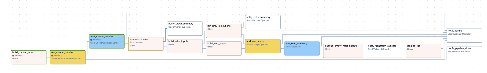
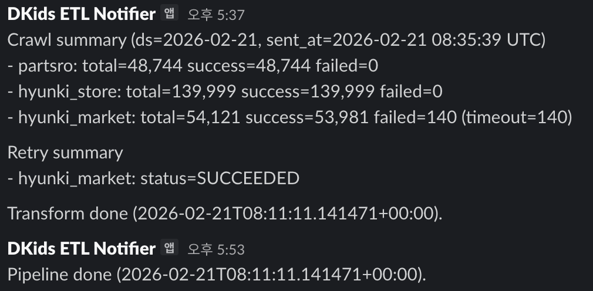

  <h1>Automotive Parts Data Pipeline</h1>
  
<b>Airflow 기반 자동차 부품 가격 데이터 수집·정제 파이프라인</b>

---

## 1. 프로젝트 개요

이 파이프라인은 **자동차 부품 가격 데이터를 매일 수집하고 정제해 서비스에 바로 활용할 수 있도록 적재**하는 것을 목표로 합니다.  
단순 수집을 넘어, 운영 중 발생할 수 있는 리스크를 줄이고 데이터가 깨지지 않도록 관리하는 데 초점을 두었습니다.

---

## 2. 파이프라인 설계 및 실행 흐름

각 단계의 실행 상태를 관리하며, 실패가 발생해도 처음부터 다시 실행하지 않고 **해당 단계부터 재시작**할 수 있도록 구성했습니다.

  

1. **Ingestion Preparation**  
   소스별 크롤링에 필요한 입력 파라미터 생성

2. **Master Step Functions**  
   AWS Step Functions를 호출해 분산 크롤링 수행 및 완료 대기

3. **Slack Notification**  
   크롤링 결과 요약(성공/실패 건수 등) 전송

4. **Self-Healing**  
   실패 URL을 DynamoDB에서 조회해 재시도 라운드 자동 실행

5. **EMR Spark Transformation**  
   분산 환경에서 데이터 정제 및 비즈니스 로직 적용

6. **Data Validation & Cleanup**  
   빈 산출물(Empty CSV) 검증 후 필요 시 정리 및 적재 스킵

7. **RDS Load (Upsert)**  
   최종 결과를 RDS(PostgreSQL)에 중복 없이 적재

8. **Final Report**  
   전체 파이프라인 완료 상태 알림

---

## 3. 핵심 운영 및 안정성 설계

### ▪️ AWS 인증 보안 (STS / MFA)

보안 가이드라인에 따라 MFA 기반 임시 자격 증명(STS 토큰)을 사용합니다.  
매번 수동 인증하는 번거로움을 줄이기 위해 `start_with_mfa.sh` 스크립트를 작성해 아래 과정을 자동화했습니다.

- MFA 코드 입력 및 STS 토큰 발급
- Airflow 환경 변수(`AWS_SESSION_TOKEN` 등) 주입
- 스케줄러 및 웹 서버 컨테이너 자동 재기동

---

### ▪️ 스케줄링 정책: `catchup=False`

- 과거 구간을 자동 backfill 하지 않고, **매일 최신 데이터 확보에 집중**합니다.
- 대량 재실행으로 인한 외부 사이트 부하 및 내부 리소스 부담을 방지합니다.
- 과거 데이터가 필요한 경우에만 수동 실행으로 통제합니다.

---

### ▪️ 멱등성 (Idempotency) 보장

동일 작업을 여러 번 수행해도 결과가 달라지지 않도록 설계했습니다.

- **Spark**  
  `mode("overwrite")`를 사용해 특정 파티션 재실행 시 파일 중복 방지

- **RDS (PostgreSQL)**  
  `ON CONFLICT (part_official_name, car_type, extracted_at) DO UPDATE`  
  구문을 사용해 중복 삽입 방지

- **Step Functions**  
  실행명에 `{{ ts_nodash }}` + `{{ ti.try_number }}`를 조합해 재시도 시 ID 충돌 방지

---

## 4. 장애 대응 및 모니터링

| 단계 | 발생 가능 리스크 | 대응 전략 |
| :--- | :--- | :--- |
| **크롤링** | 외부 사이트 지연, Lambda Throttle | Step Functions 내 지수 백오프 적용 및 DynamoDB 기반 재시도 라운드 운영 |
| **Spark 변환** | 비정상 완료(빈 파일 생성) | `cleanup_empty_mart_outputs` 태스크로 데이터 유무 검증 후 적재 스킵 |
| **데이터 적재** | DB 커넥션 오류, 키 충돌 | Python 레벨 중복 제거 후 DB Upsert 적용 |
| **공통** | 태스크 실패 | `on_failure_callback`으로 Slack에 로그 URL 전송 (최대 2회 자동 재시도) |

 

  

---

## 5. 인프라 설정 관리 (Admin)

<b>관리 항목 상세 (Connections / Variables)</b>

 

### Connections

- `aws_default` : AWS 리소스 접근 (환경 변수 기반 인증)
- `rds_default` : RDS(PostgreSQL) 연결 정보
- `slack_webhook_default` : Slack 알림 채널 웹훅

### Variables

- **Storage**  
  `DATA_BUCKET`, `RAW_S3_PREFIX`, `MART_S3_PREFIX` 등 경로 설정

- **Compute**  
  `EMR_CLUSTER_ID`, `MASTER_SFN_ARN` 등 인프라 ARN 정보

- **Crawler**  
  `SUPPLIER_CODE`, `MAX_PAGES`, `CRAWL_COUNT` 등 수집 파라미터

- **Database**  
  `RDS_TABLE`, `DDB_TABLE` 정보

---

## 6. 실행 환경

- **Executor**: `LocalExecutor` (Docker Compose 기반)
- **Metadata DB**: PostgreSQL
- **선택 배경**: 상시 클라우드 상주 비용을 줄이면서, 로컬 환경에서 빠른 디버깅과 병렬 태스크 실행이 가능하도록 구성했습니다.
