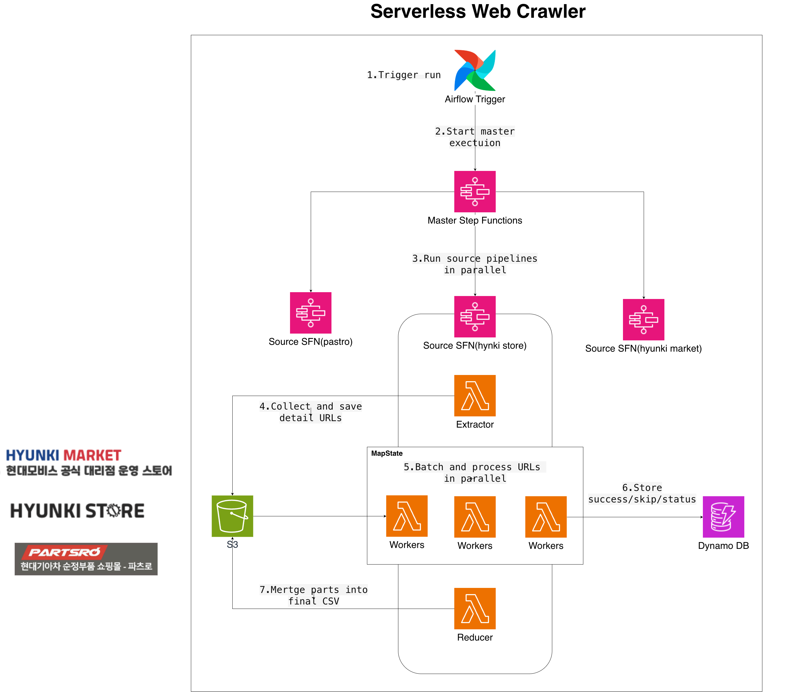
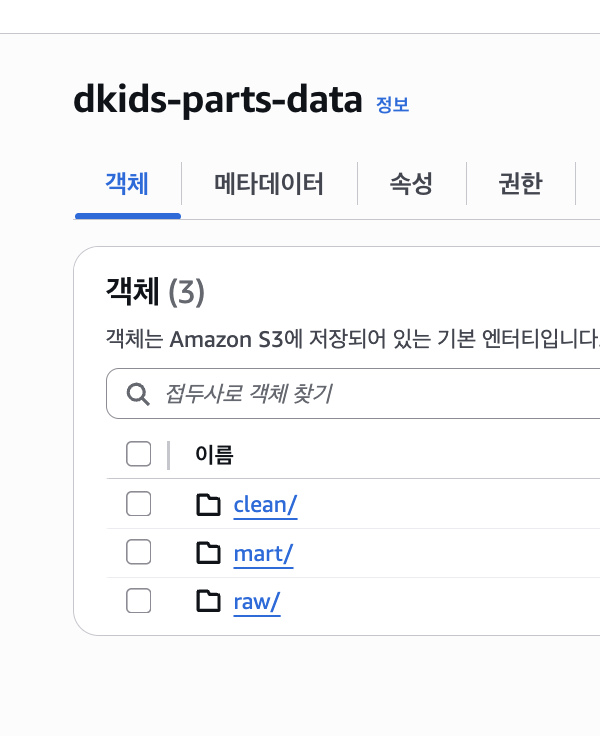
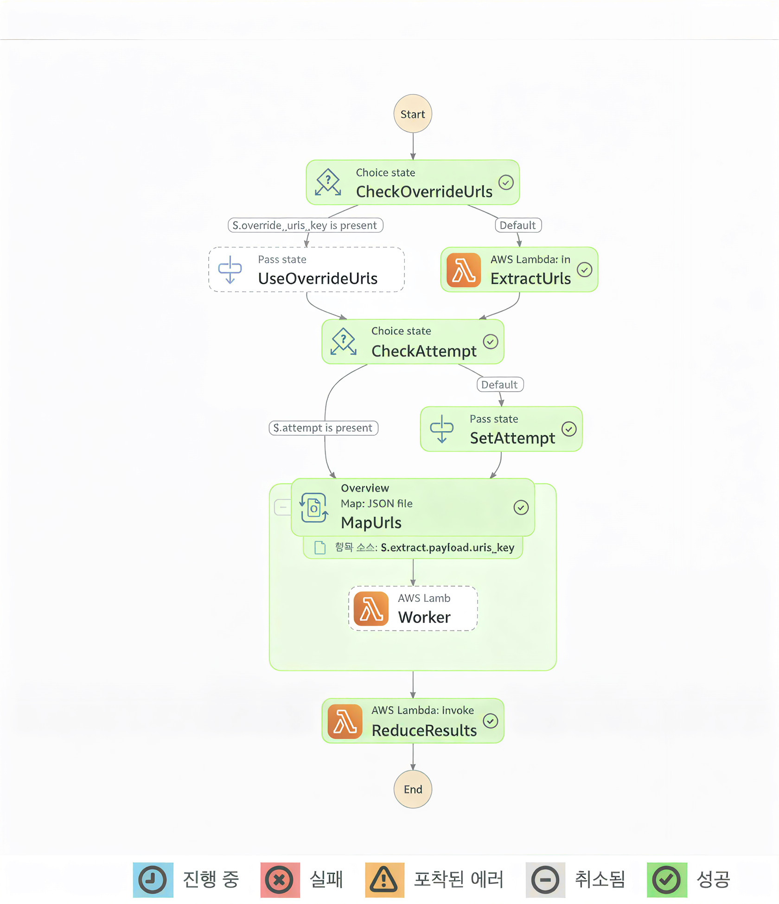
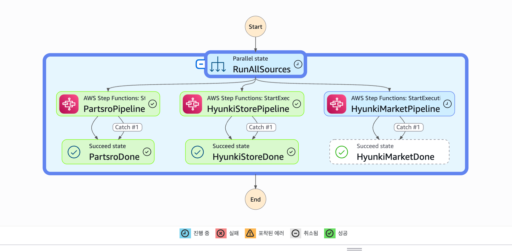

<h1 align="center">Crawler Pipeline</h1>

  <strong>AWS Step Functions 기반 자동차 부품 수집 파이프라인</strong> 
  partsro · hyunki_store · hyunki_market

<h2>1. 왜 이 구조를 선택했는가</h2>

<h3>문제 상황</h3>

<ul>
  <li>수집 대상 데이터: 약 <strong>19만건</strong></li>
  <li>로컬 단일 실행 기준 전체 크롤링 시간: <strong>20시간+</strong></li>
  <li>URL 단위 실패(404 / timeout / http error) 반복 발생 가능</li>
</ul>

<h3>설계 질문</h3>

<ol>
  <li>대량 URL을 안정적으로 병렬 처리할 수 있는가?</li>
  <li>실패 URL만 다시 수집할 수 있는가?</li>
  <li>실행 상태를 소스 단위 / 배치 단위로 추적할 수 있는가?</li>
</ol>

<h3>Step Functions vs SQS + Lambda</h3>

이번 파이프라인은 <strong>“대량 배치 실행 + 단계형 흐름 + 재시도 추적”</strong>이 핵심이었고,
이를 기준으로 <code>Step Functions (Map)</code>를 오케스트레이터로 선택했습니다.

<table>
  <thead>
    <tr>
      <th>항목</th>
      <th>Step Functions (현재 선택)</th>
      <th>SQS + Lambda</th>
    </tr>
  </thead>
  <tbody>
    <tr>
      <td>실행 단위 관리</td>
      <td>run 단위 상태머신 시작/종료 명확</td>
      <td>큐 소비 중심, run 경계 별도 설계 필요</td>
    </tr>
    <tr>
      <td>병렬 처리</td>
      <td>Distributed Map + MaxConcurrency 제어</td>
      <td>이벤트 소스 매핑으로 확장 가능</td>
    </tr>
    <tr>
      <td>실패/재시도 가시성</td>
      <td>상태 전이, 실패 지점, 재시도 정책 정의 파일에 명시</td>
      <td>DLQ/재처리 흐름 별도 구성 필요</td>
    </tr>
    <tr>
      <td>파이프라인 적합성</td>
      <td>extractor → worker → reducer 흐름 관리 용이</td>
      <td>완료 조건 / reducer 트리거 설계 필요</td>
    </tr>
    <tr>
      <td>Lambda 15분 제한 대응</td>
      <td>단계 분리로 자연스럽게 회피</td>
      <td>가능하나 오케스트레이션 코드 추가 필요</td>
    </tr>
  </tbody>
</table>

결론적으로, 현재 요구사항에서는 Step Functions 중심 구조가 구현과 운영 모두에서 유리했습니다.

<h2>2. 전체 흐름 (Master 병렬 실행)</h2>

Airflow는 트리거 및 운영 가시성 확보 역할만 수행하고,
실제 소스 병렬 실행은 <strong>Master Step Functions</strong>가 담당합니다.

<ul>
  <li>Airflow DAG 메인 경로는 직렬 유지</li>
  <li>Master가 3개 소스 상태머신 병렬 분기</li>
  <li>각 소스 내부는 Distributed Map으로 worker 병렬 실행</li>
</ul>

<pre>
Airflow Trigger
        │
        ▼
Master Step Functions
   ├─ partsro
   ├─ hyunki_store
   └─ hyunki_market
</pre>

  

<h2>3. 폴더 구조와 역할</h2>

<pre>
sources/&lt;source&gt;/
  ├─ extractor/
  ├─ worker/
  ├─ reducer/
  └─ stepfunctions/

aws/stepfunctions/
  └─ master_state_machine.json

runs/
  └─ *.input.json
</pre>

<h3>역할 정의</h3>

<ul>
  <li><strong>extractor</strong>: 목록/카테고리 페이지 순회 → 상세 URL 목록(urls.json) 생성</li>
  <li><strong>worker</strong>: 상세 페이지 파싱 → part-*.csv 저장 + skip 로그 + DynamoDB 기록</li>
  <li><strong>reducer</strong>: 배치 CSV 병합 → final.csv 생성</li>
  <li><strong>stepfunctions</strong>: 소스별 상태머신 정의(JSON)</li>
  <li><strong>master_state_machine.json</strong>: 3개 소스 병렬 실행 정의</li>
  <li><strong>runs/*.input.json</strong>: 실행 입력 샘플</li>
</ul>

<h2>4. 상태머신 설계</h2>

<h3>4.1 Master State Machine</h3>

<ul>
  <li><code>Parallel</code> 브랜치로 3개 소스 동시 실행</li>
  <li><code>states:startExecution.sync</code>로 자식 완료까지 대기</li>
  <li>브랜치별 <code>Catch(States.ALL)</code> 적용</li>
</ul>

의도: 특정 소스 장애가 다른 소스 실행을 중단시키지 않도록 실패 격리.

<h3>4.2 Source State Machine (공통 구조)</h3>

<ol>
  <li>CheckOverrideUrls</li>
  <li>ExtractUrls 또는 UseOverrideUrls</li>
  <li>CheckAttempt (없으면 SetAttempt=1)</li>
  <li>MapUrls (Distributed Map)</li>
  <li>ReduceResults</li>
</ol>

<h4>핵심 설정</h4>

<ul>
  <li>Map 모드: <strong>DISTRIBUTED</strong></li>
  <li>MaxItemsPerBatch = 100</li>
  <li>MaxConcurrency = 50</li>
  <li>재시도: Interval=2s, MaxAttempts=6, BackoffRate=2.0</li>
</ul>

<h4>override_urls_key 용도</h4>

<ul>
  <li>재시도 시 extractor 생략</li>
  <li>기존 S3 URL manifest로 바로 worker 실행</li>
  <li>대량 URL 처리에서는 Distributed Map이 실행 관리 측면에서 유리</li>
</ul>

<h2>5. S3 저장 구조</h2>

  

<pre>
raw/
  partsro/
    urls/dt=YYYY-MM-DD/&lt;run_id&gt;/urls.json
    parts/dt=YYYY-MM-DD/&lt;run_id&gt;/part-000001.csv
    skipped/dt=YYYY-MM-DD/&lt;run_id&gt;/skip-000001.json
    final/dt=YYYY-MM-DD/&lt;run_id&gt;/final.csv
    retry/dt=YYYY-MM-DD/run_id=&lt;retry_run_id&gt;/urls.json
</pre>

<h3>파일 의미</h3>

<ul>
  <li><strong>urls.json</strong>: extractor 산출 URL 목록</li>
  <li><strong>part-*.csv</strong>: worker 배치 결과 (헤더 없음)</li>
  <li><strong>skip-*.json</strong>: timeout/404 등 skip 기록</li>
  <li><strong>final.csv</strong>: reducer 병합 결과 (헤더 + UTF-8 BOM)</li>
  <li><strong>retry/urls.json</strong>: 재시도용 URL manifest</li>
</ul>

<h2>6. DynamoDB 로그 구조 (옵션)</h2>

<h3>Key 설계</h3>

<ul>
  <li>pk = &lt;source&gt;#dt=&lt;YYYY-MM-DD&gt;</li>
  <li>sk = sha1(url)</li>
</ul>

<h3>주요 속성</h3>

<ul>
  <li>source, dt, run_id, url</li>
  <li>status (SUCCESS / FAILED)</li>
  <li>reason (timeout / not_found / http_error ...)</li>
  <li>http_status</li>
  <li>attempt</li>
  <li>updated_at (ISO-8601)</li>
  <li>ttl (기본 30일)</li>
</ul>

사용 목적:

<ol>
  <li>URL 단위 성공/실패 추적</li>
  <li>특정 날짜 실패 URL 조회</li>
  <li>Airflow 재시도 입력 생성</li>
</ol>

<h2>7. 실행 입력 파일 가이드</h2>

<h3>단일 소스 실행</h3>

  

<ul>
  <li>runs/partsro.input.json</li>
  <li>runs/hyunki_store.input.json</li>
  <li>runs/hyunki_market.input.json</li>
</ul>

<h4>공통 필드</h4>

<ul>
  <li>bucket</li>
  <li>urls_prefix / result_prefix / skip_prefix / final_prefix</li>
  <li>run_id</li>
  <li>list_url 또는 category_urls</li>
  <li>max_pages, count, supplier_code</li>
  <li>attempt</li>
  <li>override_urls_key</li>
</ul>

<h3>Master 실행</h3>

  

<ul>
  <li>runs/master.input.json</li>
  <li>최상위에 각 소스 입력 중첩</li>
</ul>

<h2>8. 소스별 출력 스키마 차이</h2>

처리 단계와 저장 경로는 동일하지만, CSV 컬럼은 일부 다릅니다.

<ul>
  <li><strong>partsro, hyunki_store</strong> 
    extracted_at, category, name, price, official_name, part_no, applicable
  </li>
   
  <li><strong>hyunki_market</strong> 
    extracted_at, name, part_no, price, car_type
  </li>
</ul>

이 차이는 이후 transformation 단계에서 표준화합니다.

