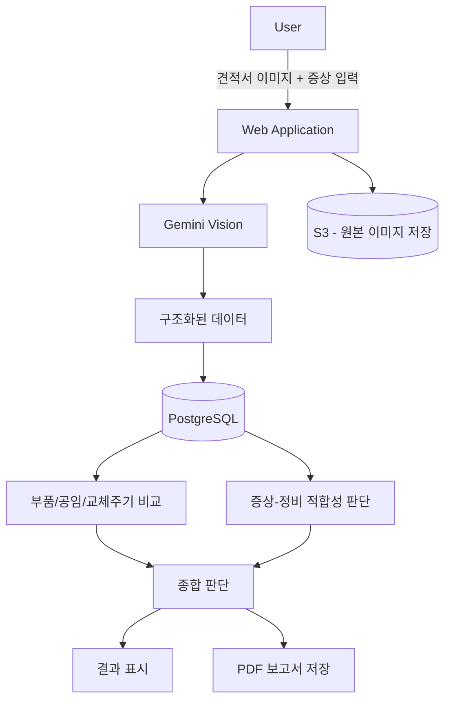
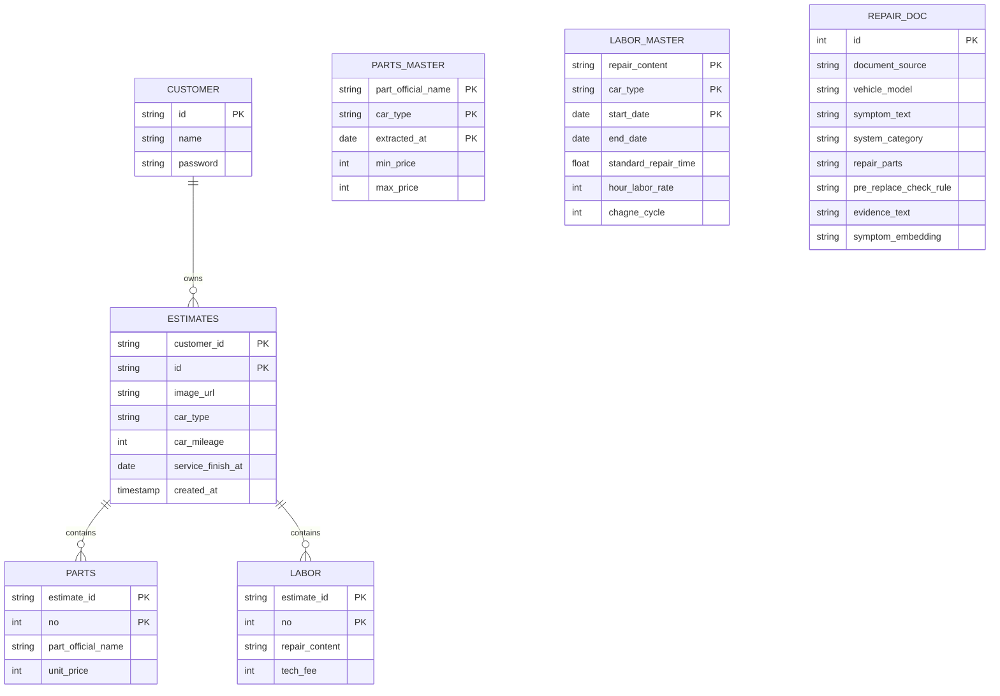

  <h1>CarCheck — 정비 사후 견적 검증 시스템</h1>
  
<b>설계 과정에서의 기술적 선택과 고민</b>

---

## 1. 설계의 출발점

CarCheck는 “정비가 필요한가?”를 판단하는 서비스가 아니라,
**이미 완료된 정비가 적절했는지를 사후에 검증하는 서비스**입니다.

사용자가 실제로 궁금해하는 것은 다음과 같습니다.

* 부품 가격이 적정했는가
* 공임이 기준을 벗어나지 않았는가
* 소모품이 너무 이르게 교체되지 않았는가
* 내가 말한 증상과 실제 정비 항목이 관련이 있었는가

이 네 가지는 서로 다른 성격의 판단입니다.

* 부품·공임 → 정형 데이터 비교
* 교체주기 → 이력 기반 계산
* 증상 적합성 → 문서 기반 판단

따라서 설계의 목표는
이 서로 다른 판단 기준을 하나의 구조 안에서 통합하는 것이었습니다.

---

## 2. 전체 구조

핵심은 다음과 같습니다.

1. 비정형 이미지를 구조화 단계에서 정리
2. 정형 비교와 문서 판단을 동일 데이터베이스에서 처리
3. 여러 기준을 종합해 결과를 제시

---

## 3. OCR 설계 — 구조화 중심 접근

견적서는 형식이 일정하지 않습니다.

* 표 구조가 고정되어 있지 않음
* 부품과 공임 항목이 섞여 있음
* 항목 위치가 매번 다름

초기에는 일반 OCR로 텍스트를 추출한 뒤,
Python에서 파싱하는 방식을 고려했습니다.

하지만 줄 구조 붕괴, 텍스트 오인식, 필드 누락 등이 자주 발생했고,
예외 처리 로직이 계속 늘어나는 문제가 있었습니다.

그래서 OCR을 단순 텍스트 추출이 아니라
**처음부터 JSON 구조로 변환하는 단계**로 접근했습니다.

Gemini Vision을 사용한 이유는 다음과 같습니다.

* 이미지와 텍스트 문맥을 함께 이해 가능
* JSON 형태로 직접 반환 가능
* 별도 파싱 로직 최소화 가능

---

## 4. 무엇을 저장할 것인가

초기에는 견적서의 모든 정보를 RDB에 저장하려 했습니다.
하지만 구현을 진행하면서 다음과 같은 문제가 있었습니다.

* 실제 판정에 사용하지 않는 컬럼 증가
* 스키마 복잡도 상승

그래서 전략을 수정했습니다.

* 원본 이미지는 S3에 저장
* 판정에 필요한 최소 데이터만 RDB에 저장

모든 정보를 구조화하기보다,
판단에 직접 사용되는 데이터만 명확히 관리하는 방향을 선택했습니다.

---

## 5. 데이터 모델

### 설계에서 고려한 점

* 모든 판단은 견적서 단위 → `estimates` 중심 구조
* 트랜잭션 데이터와 기준 데이터 분리
* 시간 조건을 포함한 비교 가능 구조

특히 중요한 점은
**정비 시점 기준 비교 구조**입니다.

* 부품 가격 → `extracted_at`
* 공임 기준 → `start_date`~`end_date`

현재 기준이 아니라,
정비가 이루어진 시점 기준으로 비교하도록 설계했습니다.

---

## 6. PostgreSQL 선택 이유

처음부터 정형 비교뿐 아니라
문서 기반 판단과 벡터 검색 가능성까지 고려했습니다.

PostgreSQL을 선택한 이유는:

* 정형 데이터 처리에 안정적
* `pgvector` 확장 가능
* 동일 DB 안에서 정형 비교 + 벡터 검색 처리 가능
* 별도 검색 엔진 없이 확장 가능

단순히 구조를 단순화하기 위해서가 아니라,
초기 설계 단계에서 확장 가능성을 염두에 둔 선택이었습니다.

---

## 7. 운영 환경 분리

동일 코드베이스에서

* Local Docker PostgreSQL → 테스트 및 시연용
* EC2 PostgreSQL → 운영 데이터

로 분리했습니다.

환경 변수 기반 분기 구조를 사용해
코드 수정 없이 전환 가능하도록 구성했습니다.

